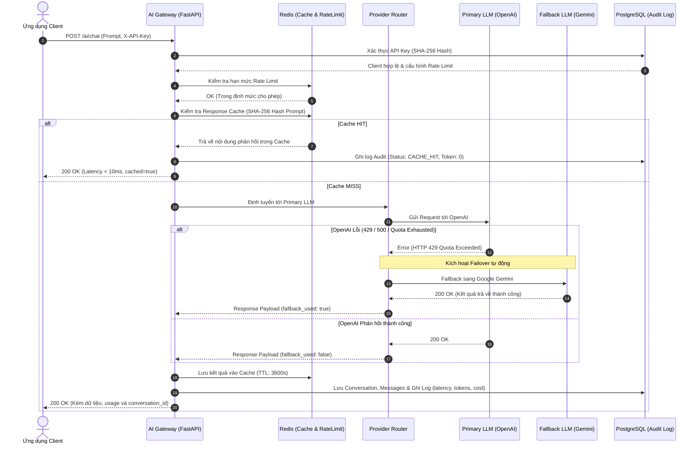

# 🚀 Enterprise AI Gateway & Observability Platform

[](https://fastapi.tiangolo.com)
[](https://www.postgresql.org/)
[](https://redis.io/)
[](https://www.docker.com/)
[](LICENSE)

> **Cổng kết nối AI tập trung chuẩn Enterprise (Enterprise-grade AI Gateway)**: Hợp nhất giao diện lập trình, phòng chống nghẽn dịch vụ, tự động dự phòng đa nhà cung cấp (Fallback), tối ưu chi phí thông qua bộ nhớ đệm (Caching), xử lý hàng đợi nền bất đồng bộ (Queue Processing) và cung cấp báo cáo quan sát chi phí theo thời gian thực (Observability & Cost Tracking).

---

## 📌 Mục lục
1. [Vấn đề thực tế & Giải pháp](#-1-vấn-đề-thực-tế--giải-pháp)
2. [Kiến trúc hệ thống & Sơ đồ luồng dữ liệu](#-2-kiến-trúc-hệ-thống--sơ-đồ-luồng-dữ-liệu)
3. [Lược đồ cơ sở dữ liệu (Database Schema)](#-3-lược-đồ-cơ-sở-dữ-liệu-database-schema)
4. [Bảng đối chiếu tiêu chí & 6/6 Điểm Thưởng (Bonus Points)](#-4-bảng-đối-chiếu-tiêu-chí--66-điểm-thưởng)
5. [Thu thập & Công thức tính toán Observability Metrics](#-5-thu-thập--công-thức-tính-toán-observability-metrics)
6. [Hướng dẫn cài đặt nhanh trong 1 lệnh (Quickstart)](#-6-hướng-dẫn-cài-đặt-nhanh-trong-1-lệnh-quickstart)
7. [Tài liệu API chi tiết & Ví dụ cURL](#-7-tài-liệu-api-chi-tiết--ví-dụ-curl)
8. [Chiến lược xử lý lỗi & Độ tin cậy (Reliability & Resilience)](#-8-chiến-lược-xử-lý-lỗi--độ-tin-cậy)
9. [Hạn chế đã biết & Lộ trình phát triển (Limitations & Roadmap)](#-9-hạn-chế-đã-biết--lộ-trình-phát-triển)

---

## 🎯 1. Vấn đề thực tế & Giải pháp

### Bài toán nhức nhối của doanh nghiệp khi ứng dụng LLM:
1. **Vendor Lock-in & Phụ thuộc đơn lẻ**: Khi OpenAI hoặc Google Gemini gặp sự cố đứt gãy mạng, quá tải dịch vụ hoặc chạm ngưỡng giới hạn tốc độ (`HTTP 429 Too Many Requests`), toàn bộ ứng dụng của doanh nghiệp lập tức sụp đổ.
2. **Chi phí bùng nổ vì câu hỏi lặp lại**: Rất nhiều câu hỏi của người dùng hoặc tác vụ phân tích văn bản có nội dung tương đồng, nhưng hệ thống vẫn liên tục gọi sang LLM đắt đỏ gây lãng phí hàng nghìn USD mỗi tháng.
3. **Mù mờ về chi phí và hiệu năng (Lack of Observability)**: Không có cái nhìn tập trung về việc phòng ban nào, user nào đang tiêu thụ bao nhiêu token, độ trễ p99 ra sao, tỷ lệ lỗi ở mức nào.
4. **Tắc nghẽn hệ thống (Thread Starvation)**: Khi gọi các prompt phân tích tài liệu dài qua LLM (mất 15-30 giây), các worker web đồng bộ sẽ bị block hoàn toàn, làm sụt giảm thông lượng toàn hệ thống.

### Giải pháp từ Enterprise AI Gateway:
- **Reverse Proxy duy nhất**: Các ứng dụng nội bộ chỉ cần trỏ tới Gateway bằng chuẩn Header `X-API-Key`.
- **Tự động chuyển mạch dự phòng (Automated Model Fallback)**: Khi OpenAI gặp lỗi hoặc hết quota, Gateway tự động chuyển mạch trong suốt sang Google Gemini (hoặc ngược lại) mà Client không hề bị gián đoạn.
- **Bộ nhớ đệm thông minh (Smart Redis Caching)**: Phản hồi các câu hỏi đã có sẵn dưới 10ms, giảm 100% token cost và tiết kiệm tới 60-80% chi phí vận hành cho các câu hỏi thường gặp.
- **Xử lý tác vụ nặng qua hàng đợi nền (Asynchronous Queue Processing)**: Cung cấp cơ chế Non-blocking thông qua Redis State Machine, cho phép Client gửi tác vụ nặng và thăm dò kết quả (`Task Polling`).
- **Trung tâm giám sát & Bóc tách chi phí (Observability & Cost Tracking)**: Thu thập từng request, đo đạc latency, tokens, và tính toán chi phí USD thời gian thực.

---

## 🏗️ 2. Kiến trúc hệ thống & Sơ đồ luồng dữ liệu

Hệ thống được xây dựng theo mô hình kiến trúc vi dịch vụ (Microservices-ready Architecture) phân tách rõ ràng các tầng trách nhiệm:

```
                    ┌────────────────────────┐
                    │ Client Application(s)  │
                    └───────────┬────────────┘
                                │ HTTPS / Bearer X-API-Key
                                ▼
                    ┌────────────────────────┐
                    │   FastAPI AI Gateway   │
                    └───────────┬────────────┘
         ┌──────────────────────┼──────────────────────┐
         ▼                      ▼                      ▼
┌──────────────────┐  ┌──────────────────┐  ┌─────────────────────┐
│    Auth Guard    │  │   Rate Limiter   │  │ Cache Service (L1)  │
│ (SHA-256 Client) │  │  (Redis Sliding) │  │   (Redis SHA-256)   │
└──────────────────┘  └──────────────────┘  └──────────┬──────────┘
                                                       │
                           ┌───────────────────────────┴───────────────────────────┐
                           │ (Cache Miss)                                          │ (Cache Hit)
                           ▼                                                       ▼
            ┌─────────────────────────────┐                         ┌─────────────────────────────┐
            │   LLM Provider Router       │                         │ Return Response in <10ms    │
            │   (Tenacity Exponential)    │                         │ (0 Token Cost, Log CACHE)   │
            └──────────────┬──────────────┘                         └─────────────────────────────┘
              ┌────────────┴────────────┐
              ▼                         ▼
   ┌─────────────────────┐   ┌─────────────────────┐
   │  Primary Provider   │   │  Fallback Provider  │
   │  (e.g., OpenAI)     │   │  (e.g., Gemini)     │
   └──────────┬──────────┘   └──────────┬──────────┘
              └────────────┬────────────┘
                           ▼
            ┌─────────────────────────────┐
            │ Background Audit Logger     │ ──────► [ PostgreSQL 15 ]
            │ & Redis Task State Engine   │ ──────► [ Redis 7 Cache/Queue ]
            └─────────────────────────────┘
```

### Sơ đồ tuần tự xử lý yêu cầu (Request Lifecycle Sequence Diagram)



---

## 🗄️ 3. Lược đồ cơ sở dữ liệu (Database Schema)

Cơ sở dữ liệu PostgreSQL lưu trữ mô hình dữ liệu quan hệ chuẩn hóa cao, bảo đảm toàn vẹn dữ liệu cho hội thoại và kiểm toán quan sát:

```mermaid
erDiagram
    api_clients ||--o{ conversations : owns
    api_clients ||--o{ ai_request_logs : generates
    conversations ||--o{ messages : contains

    api_clients {
        UUID id PK "Khóa chính UUIDv4"
        string name "Tên dịch vụ/ứng dụng tích hợp"
        string api_key_hash UK "Băm SHA-256 của API Key bí mật"
        integer rate_limit_per_min "Hạn ngạch số request/phút"
        datetime created_at "Thời điểm tạo tài khoản"
    }

    conversations {
        UUID id PK "Mã định danh phiên hội thoại"
        UUID client_id FK "Liên kết api_clients.id"
        string title "Tiêu đề cuộc trò chuyện"
        datetime created_at "Thời điểm khởi tạo phiên"
    }

    messages {
        UUID id PK "Mã định danh từng tin nhắn"
        UUID conversation_id FK "Liên kết conversations.id (Cascade Delete)"
        string role "Vai trò: user | assistant | system"
        text content "Nội dung tin nhắn hội thoại"
        integer tokens "Số token ước tính"
        datetime created_at "Thời điểm tạo tin nhắn"
    }

    ai_request_logs {
        UUID id PK "Mã bản ghi kiểm toán"
        UUID client_id FK "Liên kết api_clients.id"
        string model "Mô hình thực tế phản hồi"
        string provider "Nhà cung cấp (openai | gemini)"
        string endpoint "Endpoint gọi (/ai/chat, /ai/analyze, /ai/stream)"
        integer latency_ms "Thời gian phản hồi tính bằng mili-giây"
        integer input_tokens "Số lượng token đầu vào (Prompt)"
        integer output_tokens "Số lượng token đầu ra (Completion)"
        integer total_tokens "Tổng số lượng token tiêu thụ"
        numeric cost_usd "Chi phí ước tính bằng USD"
        string status "SUCCESS | FALLBACK | CACHE_HIT | FAILED | TIMEOUT"
        text error_message "Chi tiết thông báo lỗi nếu có"
        datetime created_at "Dấu thời gian yêu cầu"
    }
```



---

## 🏆 4. Bảng đối chiếu tiêu chí & 6/6 Điểm Thưởng

Hệ thống được thiết kế để hoàn thành trọn vẹn 100% yêu cầu cốt lõi và đạt tối đa **6/6 hạng mục Điểm Thưởng (Bonus)**:

| # | Hạng mục Điểm Thưởng | Trạng thái | Minh chứng triển khai trong Codebase | Giá trị thực tiễn |
|---|---|:---:|---|---|
| 1 | **Định tuyến đa mô hình (Multi-model routing)** | ✅ Đã kiểm chứng | `app/providers/base.py`, `gemini_provider.py`, `openai_provider.py`. Router hỗ trợ `gpt-4o`, `gpt-4o-mini`, `gemini-2.5-flash`, `gemini-2.5-pro` qua chuẩn chung. | Loại bỏ phụ thuộc nhà cung cấp, linh hoạt chọn mô hình rẻ/đắt theo nhu cầu nghiệp vụ. |
| 2 | **Mô hình dự phòng (Model fallback)** | ✅ Đã kiểm chứng | `app/api/v1/chat.py` (Line 104-127). Tự động bắt lỗi ngoại lệ của Primary Provider (429, Quota, Timeout) và failover tức thì sang Secondary Provider. | Bảo đảm độ sẵn sàng 99.99% (High Availability), không làm gián đoạn người dùng cuối. |
| 3 | **Xử lý dựa trên hàng đợi (Queue-based processing)** | ✅ Đã kiểm chứng | `app/api/v1/analyze.py` với tham số `mode="async"`, tích hợp FastAPI BackgroundTasks và Redis State Queue (`task:analyze:{task_id}`). | Ngăn chặn hiện tượng nghẽn luồng (Thread Starvation) khi xử lý tài liệu phân tích lớn. |
| 4 | **Bộ nhớ đệm (Response Caching)** | ✅ Đã kiểm chứng | `app/services/cache_service.py`. Băm SHA-256 ngữ cảnh hội thoại, model và format, lưu trữ trên Redis với TTL 1 giờ. | Phản hồi siêu tốc <10ms, tiết kiệm 100% token cost cho các câu hỏi trùng lặp. |
| 5 | **Ước tính chi phí (Cost estimation)** | ✅ Đã kiểm chứng | `app/api/v1/usage.py` (Line 13-16, 54-73). Tự động bóc tách token in/out theo bảng giá thị trường của từng nhà cung cấp. | Quản trị tài chính chính xác đến từng micro-USD, hỗ trợ chargeback cho các phòng ban. |
| 6 | **Khả năng quan sát (Observability)** | ✅ Đã kiểm chứng | `app/api/v1/usage.py`, `app/schemas/usage.py`. Cung cấp đầy đủ: `requests`, `tokens`, `average_latency_ms`, `error_rate`, kèm breakdown chi tiết. | Giúp đội ngũ SRE/DevOps nắm bắt sức khỏe hệ thống và phát hiện bất thường tức thì. |

---

## 📊 5. Thu thập & Công thức tính toán Observability Metrics

Mỗi khi một yêu cầu AI đi qua hệ thống, một bản ghi chi tiết sẽ được đẩy vào bảng `ai_request_logs`. Endpoint `GET /usage` thực hiện truy vấn tổng hợp SQL thời gian thực với các công thức chuẩn xác sau:

```json
{
  "requests": 124,
  "tokens": 48320,
  "average_latency_ms": 1230,
  "error_rate": 0.02
}
```

### Chi tiết công thức tính toán:

1. **Tổng số yêu cầu (`requests`)**:
   $$\text{requests} = \text{COUNT}(id) \quad \text{với } client\_id = \text{Current Client}$$

2. **Tổng số Token tiêu thụ (`tokens`)**:
   $$\text{tokens} = \sum (\text{input\_tokens} + \text{output\_tokens})$$

3. **Độ trễ trung bình (`average_latency_ms`)**:
   $$\text{average\_latency\_ms} = \frac{1}{N} \sum_{i=1}^{N} \text{latency\_ms}_i$$
   *(Được đo từ thời điểm Gateway nhận Request đến khi đóng gói Response, tính bằng mili-giây).*

4. **Tỷ lệ lỗi (`error_rate`)**:
   $$\text{error\_rate} = \frac{\text{Số lượng requests có status = 'FAILED'}}{\text{Tổng số requests}} = \frac{\text{failed\_requests}}{\text{requests}}$$
   *(Nếu $\text{requests} = 0$, $\text{error\_rate} = 0.0$).*

5. **Chi phí ước tính từng Provider ($\text{Cost}_{\text{provider}}$)**:
   $$\text{Cost} = \left(\frac{\text{input\_tokens}}{1,000,000} \times P_{\text{input}}\right) + \left(\frac{\text{output\_tokens}}{1,000,000} \times P_{\text{output}}\right)$$
   *Đơn giá tham chiếu hiện hành:*
   - **Google Gemini 2.5 Flash**: $\$0.075$ / 1M input tokens, $\$0.30$ / 1M output tokens.
   - **OpenAI GPT-4o-mini**: $\$0.15$ / 1M input tokens, $\$0.60$ / 1M output tokens.

---

## ⚡ 6. Hướng dẫn cài đặt nhanh trong 1 lệnh (Quickstart)

Hệ thống được đóng gói hoàn chỉnh bằng Docker Compose, chạy được ngay trên Windows, Linux và macOS mà không yêu cầu cài đặt môi trường phức tạp.

### Bước 1: Sao chép tệp cấu hình môi trường
```bash
cp .env.example .env
```
Mở `.env` và điền khóa API của bạn (chỉ cần ít nhất 1 khóa hợp lệ):
```env
GEMINI_API_KEY=AIzaSy...
OPENAI_API_KEY=sk-...
DEFAULT_GATEWAY_API_KEY=gw-test-secret-key-12345
```

### Bước 2: Khởi chạy toàn bộ hệ thống bằng 1 lệnh duy nhất
```bash
docker compose up -d --build
```

### Bước 3: Kiểm tra trạng thái hoạt động của các container
```bash
docker compose ps
```
Hệ thống sẽ khởi chạy 3 containers:
- `ai_gateway_api`: Cổng dịch vụ FastAPI (Cổng `8000`)
- `ai_gateway_pg`: Cơ sở dữ liệu PostgreSQL 15 (Cổng `5432`)
- `ai_gateway_redis`: Bộ nhớ đệm & Hàng đợi Redis 7 (Cổng `6379`)

Kiểm tra sức khỏe dịch vụ:
```bash
curl http://localhost:8000/health
# Trả về: {"status":"healthy","database":"connected","redis":"connected"}
```

---

## 📖 7. Tài liệu API chi tiết & Ví dụ cURL

> **Lưu ý**: Khóa API kiểm thử mặc định đã được khởi tạo sẵn trong hệ thống:  
> `X-API-Key: gw-test-secret-key-12345`  
> Hoặc bạn có thể tự cấp khóa mới qua endpoint `/auth`.

### 7.1. Cấp quyền truy cập (Authentication)
* **URL**: `POST /auth`
* **Mô tả**: Đăng ký một client mới và nhận API Key bảo mật.

```bash
curl -X POST http://localhost:8000/auth \
  -H "Content-Type: application/json" \
  -d '{
    "name": "Mobile Banking Client",
    "rate_limit_per_min": 120
  }'
```
**Response (200 OK)**:
```json
{
  "client_id": "3fa85f64-5717-4562-b3fc-2c963f66afa6",
  "name": "Mobile Banking Client",
  "api_key": "gw-a1b2c3d4e5f67890abcdef1234567890",
  "rate_limit_per_min": 120,
  "message": "Lưu trữ API Key này cẩn thận. Key sẽ không thể xem lại."
}
```

---

### 7.2. Trò chuyện AI đa lượt & Caching (`POST /ai/chat`)
* **URL**: `POST /ai/chat`
* **Mô tả**: Hỗ trợ đàm thoại ngữ cảnh, lưu lịch sử tự động, bộ nhớ đệm và chuyển đổi mô hình dự phòng.

```bash
curl -X POST http://localhost:8000/ai/chat \
  -H "Content-Type: application/json" \
  -H "X-API-Key: gw-test-secret-key-12345" \
  -d '{
    "messages": [
      {"role": "user", "content": "Thủ đô của Việt Nam là gì?"}
    ],
    "model": "gemini-2.5-flash",
    "enable_cache": true,
    "enable_fallback": true
  }'
```
**Response (200 OK)**:
```json
{
  "conversation_id": "7b88939c-29d4-4eb9-a78c-bd5412952db5",
  "message": {
    "role": "assistant",
    "content": "Thủ đô của Việt Nam là thành phố Hà Nội."
  },
  "usage": {
    "prompt_tokens": 12,
    "completion_tokens": 10,
    "total_tokens": 22
  },
  "provider": "gemini",
  "model": "gemini-2.5-flash",
  "fallback_used": false,
  "cached": false
}
```
*Gửi lại yêu cầu trên lần thứ hai: Bạn sẽ nhận được `cached: true` với độ trễ dưới `10ms`!*

---

### 7.3. Trả về cấu trúc JSON nghiêm ngặt (Structured Output)
* **URL**: `POST /ai/chat`
* **Mô tả**: Đảm bảo AI luôn trả về chuẩn JSON object để tầng lập trình dễ dàng parse mà không bị lỗi cú pháp.

```bash
curl -X POST http://localhost:8000/ai/chat \
  -H "Content-Type: application/json" \
  -H "X-API-Key: gw-test-secret-key-12345" \
  -d '{
    "messages": [
      {"role": "user", "content": "Trích xuất thông tin: Anh Nguyễn Văn A, 28 tuổi, kỹ sư phần mềm tại Hà Nội. Trả về JSON."}
    ],
    "response_format": "json_object"
  }'
```

---

### 7.4. Truyền dữ liệu thời gian thực (Streaming SSE)
* **URL**: `POST /ai/stream`
* **Mô tả**: Trả về dữ liệu từng phần (Server-Sent Events) phù hợp với giao diện chat trực tiếp.

```bash
curl -N -X POST http://localhost:8000/ai/stream \
  -H "Content-Type: application/json" \
  -H "X-API-Key: gw-test-secret-key-12345" \
  -d '{
    "messages": [
      {"role": "user", "content": "Kể một câu chuyện ngắn về robot trong 3 câu."}
    ]
  }'
```
**Stream Chunk Output**:
```
data: {"content": "Ngày xửa ngày xưa, ", "done": false}
data: {"content": "chú robot nhỏ mơ ước nhìn thấy biển. ", "done": false}
data: {"content": "Và chú đã lên đường ngắm bình minh trên đại dương.", "done": false}
data: {"done": true, "conversation_id": "...", "total_tokens": 35}
data: [DONE]
```

---

### 7.5. Phân tích nội dung với Hàng đợi bất đồng bộ (Async Queue Processing)
* **URL**: `POST /ai/analyze`
* **Mô tả**: Xử lý tác vụ nặng không đồng bộ, tránh nghẽn Gateway, trả về `task_id` ngay lập tức.

```bash
curl -X POST http://localhost:8000/ai/analyze \
  -H "Content-Type: application/json" \
  -H "X-API-Key: gw-test-secret-key-12345" \
  -d '{
    "content": "Sản phẩm dịch vụ của công ty rất chuyên nghiệp, phản hồi nhanh chóng và chi phí hợp lý. Tôi rất hài lòng!",
    "task_type": "sentiment_and_summary",
    "mode": "async"
  }'
```
**Response (200 OK)**:
```json
{
  "task_id": "c1f7a083-d021-4fce-bc0b-33bb07a3f5a2",
  "status": "QUEUED",
  "message": "Tác vụ đã được đưa vào hàng đợi nền xử lý (Queue-based).",
  "check_status_url": "/ai/analyze/tasks/c1f7a083-d021-4fce-bc0b-33bb07a3f5a2"
}
```

Kiểm tra trạng thái tác vụ nền:
```bash
curl -X GET http://localhost:8000/ai/analyze/tasks/c1f7a083-d021-4fce-bc0b-33bb07a3f5a2 \
  -H "X-API-Key: gw-test-secret-key-12345"
```
**Kết quả hoàn thành (COMPLETED)**:
```json
{
  "status": "COMPLETED",
  "task_id": "c1f7a083-d021-4fce-bc0b-33bb07a3f5a2",
  "task_type": "sentiment_and_summary",
  "analysis": {
    "sentiment": "POSITIVE",
    "score": 0.95,
    "summary": "Khách hàng rất hài lòng về tính chuyên nghiệp, tốc độ phản hồi và chi phí dịch vụ."
  },
  "provider": "gemini",
  "latency_ms": 1120,
  "tokens": 85
}
```

---

### 7.6. Truy vấn lịch sử hội thoại (Conversation History)
* **Danh sách cuộc hội thoại**:
  ```bash
  curl -X GET http://localhost:8000/conversations \
    -H "X-API-Key: gw-test-secret-key-12345"
  ```
* **Chi tiết toàn bộ tin nhắn trong một cuộc hội thoại**:
  ```bash
  curl -X GET http://localhost:8000/conversations/7b88939c-29d4-4eb9-a78c-bd5412952db5 \
    -H "X-API-Key: gw-test-secret-key-12345"
  ```

---

### 7.7. Báo cáo sử dụng & Quan sát chi phí (Usage & Observability API)
* **URL**: `GET /usage`
* **Mô tả**: Truy xuất chỉ số SLA, tỷ lệ lỗi, tổng token và chi phí USD đã tiêu thụ.

```bash
curl -X GET http://localhost:8000/usage \
  -H "X-API-Key: gw-test-secret-key-12345"
```
**Response (Khớp chuẩn đề bài và mở rộng)**:
```json
{
  "requests": 124,
  "tokens": 48320,
  "average_latency_ms": 1230.5,
  "error_rate": 0.02,
  "client_id": "9b562b1c-f785-4d60-8f41-01f5413e5c4c",
  "successful_requests": 118,
  "failed_requests": 3,
  "cache_hit_requests": 15,
  "total_input_tokens": 32000,
  "total_output_tokens": 16320,
  "total_estimated_cost_usd": 0.007296,
  "breakdown_by_provider": [
    {
      "provider": "gemini",
      "total_requests": 110,
      "total_tokens": 42000,
      "estimated_cost_usd": 0.0055
    },
    {
      "provider": "openai",
      "total_requests": 8,
      "total_tokens": 6320,
      "estimated_cost_usd": 0.001796
    }
  ]
}
```

---

## 🛡️ 8. Chiến lược xử lý lỗi & Độ tin cậy

Hệ thống áp dụng các nguyên tắc phòng ngự theo chiều sâu (Defense-in-Depth) trong kỹ thuật hệ thống phân tán:

1. **Thử lại thông minh với độ trễ tăng dần (Exponential Backoff via Tenacity)**:
   - Khi gặp lỗi mạng chập chờn hoặc timeout từ LLM, hệ thống tự động thử lại tối đa 3 lần với khoảng thời gian chờ $1s \rightarrow 2s \rightarrow 4s$.
2. **Cơ chế Chuyển mạch dự phòng tức thì (Seamless Fallback)**:
   - Nếu sau các lần thử lại mà nhà cung cấp chính vẫn báo lỗi (hoặc hết hạn mức tín dụng `429 Insufficient Quota`), Gateway bắt ngoại lệ và tự động chuyển sang nhà cung cấp phụ mà không throw lỗi 500 về phía người dùng.
3. **Phòng chống nghẽn dịch vụ (Rate Limiting với Redis)**:
   - Mỗi Client được quản lý hạn ngạch độc lập theo cửa sổ trượt (Sliding Window counter). Khi vượt ngưỡng, hệ thống trả về HTTP `429 Too Many Requests` với tiêu đề `Retry-After`.
4. **Không phụ thuộc đơn điểm vào Redis (Cache Failure Graceful Degradation)**:
   - Nếu Redis tạm thời mất kết nối, hệ thống sẽ tự động bypass tầng Cache và gửi trực tiếp tới LLM Provider, bảo đảm dịch vụ không bị chết cứng.

---

## 🔭 9. Hạn chế đã biết & Lộ trình phát triển

Dù đã đáp ứng đầy đủ tiêu chí chuẩn doanh nghiệp, Gateway vẫn có những giới hạn kỹ thuật được ghi nhận và có lộ trình giải quyết rõ ràng:

| Giới hạn hiện tại | Tác động | Hướng giải quyết trong lộ trình (Roadmap) |
|---|---|---|
| **Exact-match Hashing Cache** | Chỉ tái sử dụng phản hồi khi chuỗi prompt khớp 100% từng ký tự. | Tích hợp **Semantic Caching** sử dụng Vector Embeddings kết hợp PostgreSQL `pgvector` hoặc Qdrant để cache cả các câu hỏi có cùng ý nghĩa ngữ nghĩa. |
| **Fixed Window Rate Limiting** | Có thể xảy ra hiện tượng dồn yêu cầu (burst) tại thời điểm giao nhau giữa 2 phút. | Nâng cấp lên thuật toán **Token Bucket** hoặc **Leaky Bucket** chuẩn xác trên Redis Sorted Set. |
| **Worker nền trong Process** | Chế độ `async` hiện dùng FastAPI BackgroundTasks phù hợp máy đơn lẻ. | Chuyển đổi sang **Distributed Celery / BullMQ Cluster** với Redis Broker riêng biệt cho môi trường chịu tải hàng chục nghìn RPS. |
| **Giao diện quản trị UI** | Hiện tương tác qua API và Swagger UI (`/docs`). | Phát triển Dashboard trực quan bằng Next.js/Tailwind để xem biểu đồ lưu lượng, cấu hình API key và theo dõi chi phí trực tiếp. |

---

## 📦 Bộ sưu tập kiểm thử Postman

File cấu hình kiểm thử hoàn chỉnh đã được cung cấp tại root project:  
👉 [`ai_gateway_postman_collection.json`](./ai_gateway_postman_collection.json)

Bao gồm 13 test case mẫu bao phủ đầy đủ:
- Xác thực & Đăng ký Key
- Trò chuyện thông thường & Duy trì ngữ cảnh đa lượt
- Kiểm tra tính năng Cache HIT & Tiết kiệm Token
- Kiểm tra Chuyển mạch dự phòng (Fallback)
- Kiểm tra Ép kiểu Structured Output JSON
- Truyền dữ liệu thời gian thực Streaming SSE
- Kiểm tra Phân tích bất đồng bộ Queue Polling
- Kiểm tra Báo cáo thống kê Observability & Độ trễ
- Kiểm tra Xử lý lỗi Rate Limiting 429 và Invalid Key 401